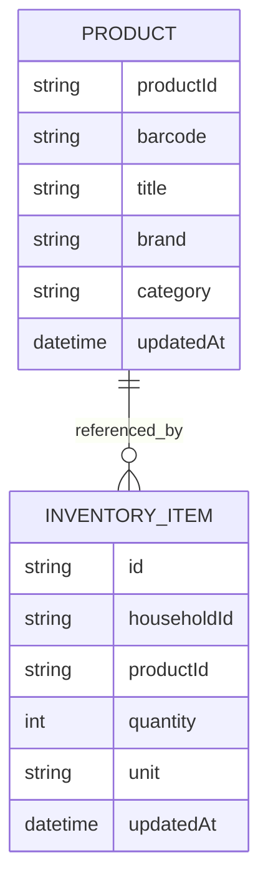
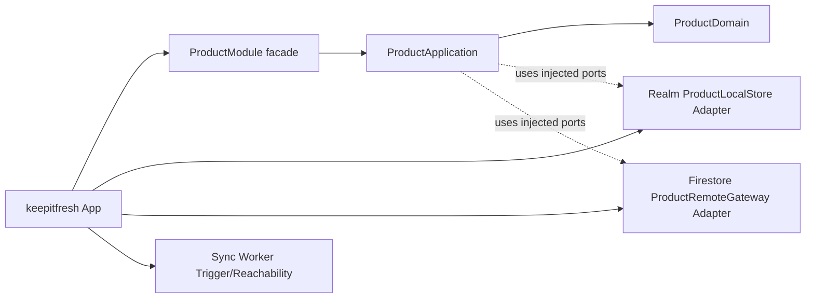
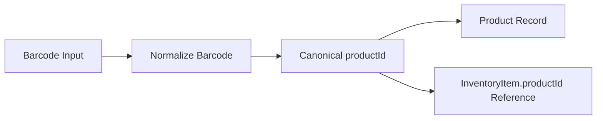
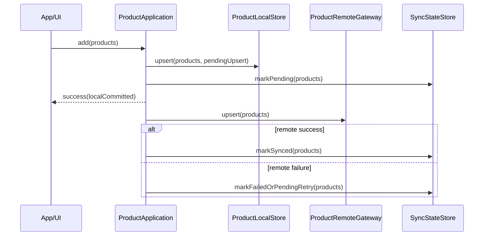
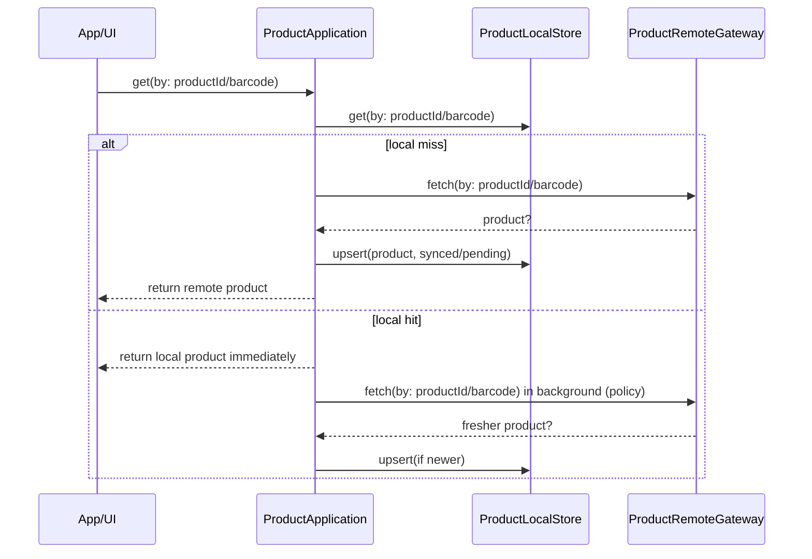
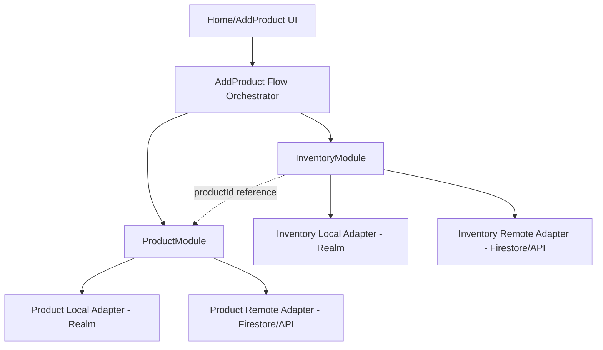

# Product Module Package Plan

Status: Draft (planning only, no implementation in this document)
Date: 2026-02-27
Owner: keepitfresh app team

## 1. Objective

Extract Product behavior from the main app into a dedicated Swift Package with clean boundaries and offline-first orchestration.

Required behaviors:
- Retrieve one product.
- Retrieve all products with pagination + sort strategy + filter strategy.
- Add one or many products.
- Update one or many products.
- Design to support delete one or many products later (not implemented now).
- Enforce `productId` as the primary and unique identifier for every product.
- If barcode exists, `productId` must equal normalized barcode value.

Hard constraints:
- Module must not know Realm, Firestore, or any concrete persistence/network implementation.
- Module must not depend on Factory (or any DI framework).
- Dependencies must be injected through protocol-based ports.

## 2. Scope and Non-Goals

In scope:
- Product domain and offline-first application orchestration.
- Contracts for local store, remote gateway, sync queue, and sync state persistence.
- Query API for pagination/sort/filter strategies.
- Migration plan from current `AddProduct` code to the package.

Out of scope:
- Concrete Realm and Firestore adapters (host app/infrastructure layer responsibility).
- Inventory module extraction (planned separately).
- Delete implementation (contract only in this plan).

## 3. Boundary Decision: Product vs Inventory

Decision:
- Product should be its own module.
- Inventory should be a separate module.

Reasoning:
- Product is canonical item knowledge (title, brand, barcode, packaging, description, category, metadata).
- Inventory is household/context stock state (quantity, batches, expiry, storage location, consumption lifecycle).
- Inventory changes frequently and is contextual; Product changes slowly and is global/cross-household.

Relationship model:
- One Product can be referenced by many InventoryItems.
- InventoryItem must depend on Product identity (`productId`).
- Product must not depend on InventoryItem.



## 4. Package Architecture

Suggested package name:
- `ProductModule`

Suggested targets (single package, multiple targets):
- `ProductDomain`
- `ProductApplication`
- `ProductModule` (facade that re-exports public API)
- `ProductModuleTests`

Dependency rule:
- `ProductDomain` has no external dependencies.
- `ProductApplication` depends only on `ProductDomain`.
- No target in this package imports Realm, Firebase, or app-specific modules.



## 5. Product Identity and Structure

### 5.1 Identity Invariants

Required invariants:
- Every product must have `productId`.
- `productId` is immutable and unique across all products.
- If `barcode` is present, `productId == normalized(barcode.value)`.
- `barcode` should be unique when present.

Normalization rule:
- Trim whitespace/newlines.
- Keep canonical barcode characters only (digits for EAN/UPC based types).
- Persist normalized value consistently for both `barcode.value` and `productId`.

Creation rules:
- With barcode: `productId = normalized(barcode.value)`.
- Without barcode: create generated `productId` (for example `prd_<uuid>`).
- If a barcode is later added to a barcode-less product, migrate to a canonical product record with `productId = normalized(barcode.value)` and keep an alias mapping for the previous `productId` during migration.

Lookup rules:
- Retrieve by `productId` is the primary path.
- Retrieve by barcode is translated to `productId` lookup after normalization.

### 5.2 Product Structure

Reference source used for structure:
- `Packages/ImageDataModule/.../ExtractedData.swift`
- Category detail models under `Extracted/Detail/*`

Inventory-only fields intentionally excluded from Product:
- packaged/manufactured/expiry/use-by/best-before dates.
- stock count and batch-level quantities.

Proposed Product aggregate (domain-facing):

```swift
public struct Product: Sendable, Codable, Equatable, Hashable {
    public let productId: String
    public var barcode: Barcode?
    public var title: String?
    public var brand: String?
    public var shortDescription: String?
    public var storageInstructions: String?
    public var category: ProductCategory?
    public var productDetails: ProductDetails?
    public var packaging: ProductPackaging?
    public var size: String?
    public var images: [ProductImage]
    public var attributes: [String: String]
    public var extractionMetadata: ProductExtractionMetadata?
    public var qualitySignals: ProductQualitySignals?
    public var compliance: ProductCompliance?
    public var source: ProductSource
    public var status: ProductStatus
    public var createdAt: Date
    public var updatedAt: Date
    public var version: Int
}
```

Field guidance:
- Required: `productId`, `createdAt`, `updatedAt`, `version`.
- Optional but recommended: `barcode`, `title`, `brand`, `category`.
- Flexible extensibility: `attributes` for non-core metadata without breaking schema evolution.

Logical field groups:
- Identity: `productId`, `barcode`
- Core display: `title`, `brand`, `shortDescription`, `images`
- Classification: `category`, `productDetails`
- Composition and pack: `packaging`, `size`
- Usage/compliance: `storageInstructions`, `compliance`
- Lifecycle/governance: `source`, `status`, `version`, `createdAt`, `updatedAt`
- AI provenance and quality: `extractionMetadata`, `qualitySignals`

ProductDetails shape (informed by `ExtractedDetails`):

```swift
public enum ProductDetails: Sendable, Codable, Equatable, Hashable {
    case food(FoodDetails?)
    case beverage(FoodDetails?)
    case household(HouseholdDetails?)
    case personalCare(PersonalCareDetails?)
    case other(UnknownDetails?)
}

public struct FoodDetails: Sendable, Codable, Equatable, Hashable {
    public var ingredients: [String]?
    public var allergens: [String]?
    public var servingSize: String?
    public var nutritionPer100gOrMl: NutritionFacts?
    public var quantityText: String?
    public var numberOfItemsText: String?
}

public struct HouseholdDetails: Sendable, Codable, Equatable, Hashable {
    public var usageInstructions: [String]?
    public var safetyWarnings: [String]?
    public var materials: [String]?
}

public struct PersonalCareDetails: Sendable, Codable, Equatable, Hashable {
    public var usageDirections: [String]?
    public var ingredients: [String]?
    public var warnings: [String]?
    public var skinType: [String]?
}

public struct UnknownDetails: Sendable, Codable, Equatable, Hashable {
    public var keyValue: [String: String]
    public var inferredCategory: String?
}
```

Additional structures beyond extraction output:
- `ProductExtractionMetadata`: `extractedAt`, `extractorVersion`, per-field confidence map, raw snippets hash.
- `ProductQualitySignals`: completeness score, image coverage flags, manual review status.
- `ProductCompliance`: regulatory tags, country market scope, restricted-product flags.
- `ProductSource`: `manual`, `barcodeLookup`, `aiExtraction`, `importedFeed`, `merged`.
- `ProductStatus`: `active`, `draft`, `archived`, `blocked`.

Recommended extra fields not directly present in current ExtractedData:
- `manufacturerName`
- `countryOfOrigin`
- `certifications` (for example organic/vegan/halal/kosher claims)
- `languageCodes` present on the label (for search/localization readiness)
- `searchKeywords` precomputed tokens for fast local filtering
- `relatedBarcodes` for multi-pack or regional barcode variants (non-primary)

Sub-structure guidance:
- `Barcode`: `value`, `symbology`, optional confidence/provenance.
- `ProductCategory`: stable identifiers (`main`, `sub`) rather than display-only text.
- `ProductImage`: stable image id, URL/path, source, width/height metadata, `kind` (`front`, `back`, `nutrition`, etc.).
- `ProductPackaging`: structured volume/weight/count + unit fields, not one freeform string only.
- `NutritionFacts`: normalized per-100g/ml numbers (`energyKcal`, `proteinG`, `fatG`, `saturatedFatG`, `carbsG`, `sugarsG`, `sodiumMg`).

Validation and evolution rules:
- Reject empty `productId` and empty barcode values.
- `updatedAt` must be monotonic for a given `productId`.
- `version` increments on each successful mutation (local and remote merge writes).
- Unknown future fields should be preserved by adapters where storage supports passthrough.
- Prefer additive schema evolution (new optional fields) to avoid migration-breaking changes.
- Keep `productDetails` case aligned with `category.main`; mismatches are corrected during normalization.

ExtractedData -> Product mapping guidance:
- `ExtractedData.title` -> `Product.title`
- `ExtractedData.brand` -> `Product.brand`
- `ExtractedData.shortDescription` -> `Product.shortDescription`
- `ExtractedData.storageInstructions` -> `Product.storageInstructions`
- `ExtractedData.barcodeInfo` -> `Product.barcode` and `productId` derivation
- `ExtractedData.category` -> `Product.category`
- `ExtractedData.productDetails` -> `Product.productDetails`
- `ExtractedData.dateInfo` -> ignored by Product module (reserved for Inventory module)
- extracted `confidence` values -> `Product.extractionMetadata.fieldConfidence`
- extracted raw snippets -> `Product.extractionMetadata.rawSnippets` (or hashed summary)

Example canonical payload shape:

```json
{
  "productId": "0123456789012",
  "barcode": { "value": "0123456789012", "symbology": "ean13" },
  "title": "Organic Milk",
  "brand": "Fresh Farm",
  "shortDescription": "Whole milk",
  "storageInstructions": "Keep refrigerated",
  "category": { "main": "food", "sub": "dairy" },
  "productDetails": {
    "type": "food",
    "value": {
      "ingredients": ["milk"],
      "allergens": ["milk"],
      "servingSize": "200ml",
      "nutritionPer100gOrMl": {
        "energyKcal": 62,
        "proteinG": 3.2,
        "fatG": 3.5,
        "saturatedFatG": 2.1,
        "carbsG": 4.7,
        "sugarsG": 4.7,
        "sodiumMg": 44
      }
    }
  },
  "packaging": { "quantity": 1, "unit": "l", "count": 1, "displayText": "1L bottle" },
  "size": "1L",
  "images": [],
  "attributes": { "origin": "local", "languageCodes": "en,ar" },
  "extractionMetadata": {
    "extractorVersion": "imagedata-v1",
    "fieldConfidence": { "barcode": 0.99, "title": 0.87, "category": 0.8 }
  },
  "qualitySignals": { "completenessScore": 0.84, "needsManualReview": false },
  "compliance": { "marketCountries": ["US"], "restrictedFlags": [] },
  "source": "aiExtraction",
  "status": "active",
  "createdAt": "2026-02-27T10:00:00Z",
  "updatedAt": "2026-02-27T10:00:00Z",
  "version": 1
}
```

Persistence constraints (adapter-level, not package-level):
- Primary key/unique index on `productId`.
- Unique index on normalized barcode when barcode exists.
- Check constraint/invariant: if barcode exists then `productId` equals normalized barcode.
- Secondary indexes for query performance: `updatedAt`, `title`, `brand`, `category.main`, `status`.

Split model recommendation:
- Keep sync metadata in separate storage record keyed by `productId` (`ProductSyncMetadata`).
- Keep domain `Product` free from storage-framework concerns.

### 5.3 Inventory Reference Contract

Inventory relationship requirements:
- Inventory record references Product by `productId`.
- Barcode in inventory is optional convenience data, not foreign-key authority.
- Product merge/migration logic must preserve `productId` continuity for inventory references.



## 6. Core Contracts (Ports)

### 6.1 Query and Strategies

Use value-based strategies for portability and testability:
- `ProductQuery`
- `ProductSortStrategy`
- `ProductFilterStrategy`
- `PageRequest` and `PageCursor`

Example shape:
- `ProductQuery(page: PageRequest, sort: ProductSortStrategy, filters: [ProductFilterStrategy])`

Expected behavior:
- Local store must support query execution.
- Remote gateway should support equivalent query translation where possible.
- If remote cannot execute all filters, module applies post-filtering after fetch.

### 6.2 Read/Write Ports

Local persistence port (`ProductLocalStore`):
- `get(productId:)`
- `getByBarcode(_:)` (normalizes barcode then resolves to `productId`)
- `query(_ ProductQuery)`
- `upsert(_ products, syncState:)`
- `delete(_ ids)` (reserved for future)
- `loadSyncMetadata(_ ids)`

Remote gateway port (`ProductRemoteGateway`):
- `fetch(productId:)`
- `fetchByBarcode(_:)` (normalizes barcode then resolves to canonical product)
- `query(_ ProductQuery)`
- `upsert(_ products)`
- `delete(_ ids)` (reserved for future)

Sync metadata port (`ProductSyncStateStore`):
- Save and retrieve sync state per product.
- Track last sync timestamp, last remote version/etag, retry count, last error.

Connectivity and timing ports:
- `ConnectivityProvider` (`isOnline`)
- `Clock` (`now`)

### 6.3 Sync Policies

`SyncStrategy` (injected):
- `readPolicy`:
  - `.localOnly`
  - `.localThenRemoteIfStale(staleAfter:)`
  - `.localThenRemoteAlwaysBackground`
- `writePolicy`:
  - `.localThenRemoteImmediate`
  - `.localThenEnqueue`
- `conflictPolicy`:
  - `.lastWriteWins`
  - `.remoteWins`
  - `.localWins`
  - `.merge(merger)`

## 7. Offline-First Flow Design

### 7.1 Add Product(s)

Flow:
1. Validate input.
2. Normalize barcode and enforce identity invariant (`barcode != nil => productId == normalized(barcode)`).
3. Save product(s) to local store with sync state `.pendingUpsert`.
4. Return success to caller immediately from local commit.
5. If online, attempt remote upsert.
6. On remote success, mark `.synced`.
7. On remote failure/offline, keep `.pendingUpsert` and schedule retry.



### 7.2 Retrieve One Product

Flow:
1. Try local first.
2. If local miss, fetch remote, cache local, return result.
3. If local hit, return local immediately.
4. If policy requires, run background remote refresh and update local.



### 7.3 Retrieve All Products (Pagination + Sort + Filter)

Flow:
1. Query local store using `ProductQuery`.
2. Return local page immediately.
3. If policy requires, request remote page with same query semantics.
4. Merge remote results into local.
5. Emit updated page when local cache changes.

Support:
- Cursor-based pagination (recommended for scalable remote APIs).
- Deterministic sort keys (`updatedAt`, `title`, `brand`, `createdAt`).
- Composable filters (`barcode`, `brand`, `category`, text search, tags, sync state).

### 7.4 Update Product(s)

Flow mirrors Add:
1. Local update first, mark `.pendingUpsert`.
2. Attempt remote update.
3. Mark `.synced` on success.
4. Retry and reconcile conflicts per policy on failure.

### 7.5 Delete Product(s) (Future-ready only)

Design now:
- Contracts include delete methods and sync-state case `.pendingDelete`.
- No implementation in this phase.

## 8. Sync State Model

Proposed sync state per product:
- `pendingUpsert`
- `synced`
- `failed(retryCount, lastError, nextRetryAt)`
- `pendingDelete` (future)

Rules:
- Local data is source of truth for UX responsiveness.
- Remote is consistency target.
- Sync engine is idempotent (safe to replay same operation).
- Retries use bounded exponential backoff with jitter.

Conflict handling:
- Default: last-write-wins with `updatedAt` + optional version token.
- Allow replacement with injected merger strategy for category-specific merges.

## 9. Product Module API Surface (Facade)

Recommended public entrypoint:
- `ProductModuleService`

Methods:
- `retrieveProduct(by:) async throws -> Product?`
- `retrieveProducts(query:) async throws -> ProductPage`
- `addProducts(_:) async throws -> AddProductsResult`
- `updateProducts(_:) async throws -> UpdateProductsResult`
- `syncPending() async`

Design notes:
- Keep API command/query focused.
- No UI types.
- No persistence/network framework types.

## 10. Migration Plan From Current Code

Current coupling observed:
- `AddProductFlowUseCase` currently orchestrates both catalog and inventory concerns.
- `CatalogRepository` and `InventoryRepository` are currently part of `AddProduct` flow contracts.
- Realm-backed local repos exist in app target (`RealmCatalogRepository`, `RealmInventoryRepository`).

Migration phases:

### Phase 0: Freeze and map
- Freeze Product-related interfaces currently used by Add Product flows.
- Add mapping table from current models (`ProductCatalogItem`) to new package `Product`.
- Enforce identity migration rule: barcode-backed records must map to `productId = normalized(barcode.value)`.
- Map `ExtractedData` fields into Product aggregate and keep `ExtractedData.dateInfo` out of Product module scope.

### Phase 1: Create package skeleton
- Add `Packages/ProductModule`.
- Create targets: `ProductDomain`, `ProductApplication`, `ProductModule`.
- Add initial tests for contracts and basic offline flow.

### Phase 2: Move Product domain + use cases
- Move Product models and query/sync contracts into package.
- Add `retrieve`, `retrieveAll`, `add`, `update`, `syncPending` orchestrators.
- Keep app-level adapters as temporary wrappers around existing repos.
- Add invariant guards rejecting writes where barcode exists but `productId` is not barcode-normalized.

### Phase 3: Adapter bridge in app target
- Implement `ProductLocalStore` adapter backed by Realm (outside package).
- Implement `ProductRemoteGateway` adapter backed by Firestore/API (outside package).
- Wire module into app composition root (Factory remains in app only).

### Phase 4: Replace Add Product direct catalog calls
- Route catalog/product operations through `ProductModuleService`.
- Keep inventory paths unchanged for now.
- Ensure barcode resolution path uses Product module when inventory misses.

### Phase 5: Stabilize and harden
- Add sync worker trigger on app launch, foreground, and connectivity regain.
- Add telemetry: pending count, sync success rate, conflict count, stale-read count.
- Complete contract-level tests + adapter tests.

### Phase 6: Inventory extraction follow-up (separate task)
- Define and extract `InventoryModule` with its own offline-first orchestration.
- Keep relation via `productId` reference only.

## 11. Product and Inventory Design Together

Target architecture after both modules exist:



Behavior split:
- Product module owns product truth and synchronization of product metadata.
- Inventory module owns stock lifecycle and household context.
- Add Product flow composes both modules but neither module depends on the other directly.

## 12. Acceptance Criteria

Architecture acceptance:
- Product package compiles without importing Realm/Firebase/Factory.
- Product package has no dependency on app targets or other feature modules.
- All dependencies are protocol-injected from composition root.

Behavior acceptance:
- Add/update are local-first with sync metadata persisted.
- Retrieve one returns local first when present, then refreshes by policy.
- Retrieve all supports cursor pagination + deterministic sort + composable filters.
- Sync replay can recover pending operations after app restart.
- Every product has unique `productId`; if barcode exists, `productId` equals normalized barcode.
- Product structure aligns with `ExtractedData` core signals while explicitly excluding inventory-only date/stock fields.

Quality acceptance:
- Unit tests for offline-first orchestration and conflict policy.
- Contract tests for query pagination/sort/filter behavior.
- Adapter tests in app target for Realm/remote mapping.

## 13. Risks and Mitigations

Risk:
- Query semantics divergence between local and remote adapters.
Mitigation:
- Canonical `ProductQuery` contract + parity tests per adapter.

Risk:
- Sync loops or duplicate writes.
Mitigation:
- Idempotency key per operation + retry caps + operation de-duplication.

Risk:
- Over-coupling from Add Product flow during migration.
Mitigation:
- Introduce anti-corruption adapter layer and migrate in phases, not a big-bang move.

## 14. Proposed Next Task Breakdown

1. Scaffold `Packages/ProductModule` with contracts and orchestrator stubs.
2. Implement Realm-backed `ProductLocalStore` adapter in app target.
3. Implement remote gateway adapter and sync worker.
4. Wire Add Product flow to use Product module for catalog/product paths.
5. Add package and adapter test suites.
